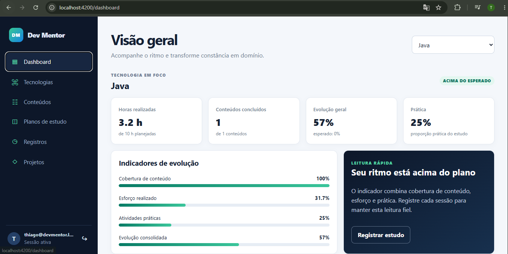
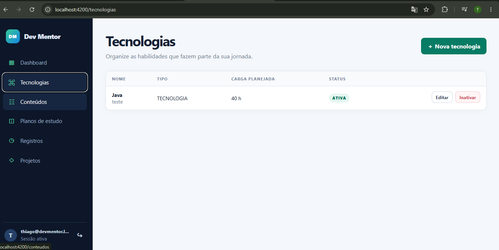
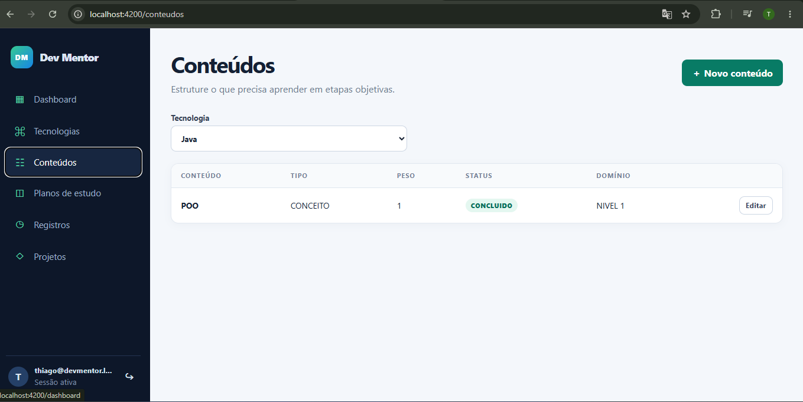
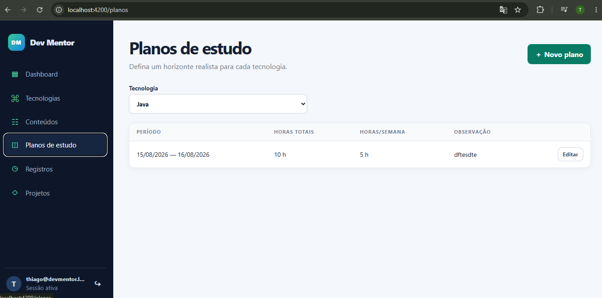
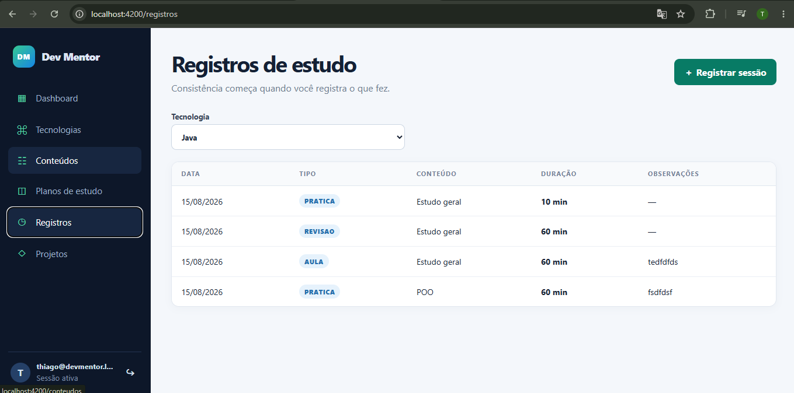
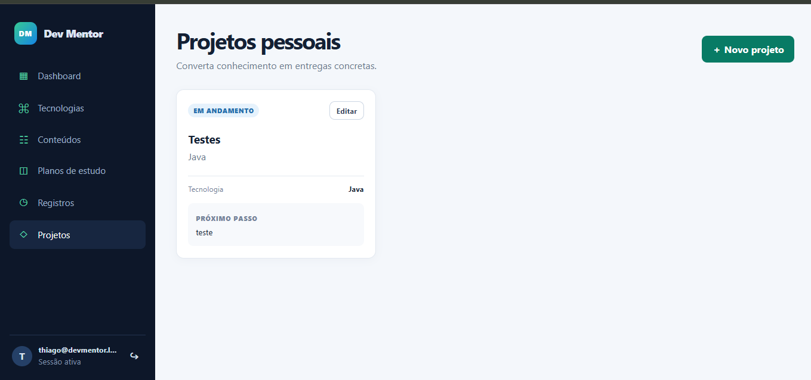

# Dev Mentor Frontend

Interface web do Dev Mentor para planejar tecnologias, acompanhar conteúdos, registrar estudos e medir evolução. O projeto é uma SPA Angular integrada à API `dev-mentor-backend`.

## Funcionalidades

- Login JWT e rotas protegidas
- Dashboard de evolução por tecnologia
- Cadastro, edição, ativação e inativação de tecnologias
- Gestão do ciclo de conteúdos: não iniciado, em andamento e concluído
- Planos de estudo por período e carga horária
- Registro de sessões de aula, prática e revisão
- Gestão de projetos pessoais
- Layout responsivo para desktop e celular
- Tratamento centralizado de erros da API

## Como o sistema funciona

O Dev Mentor organiza a evolução técnica em um fluxo único. Depois da autenticação, o
usuário cadastra uma tecnologia ou disciplina, divide o aprendizado em conteúdos, define
um plano com período e carga horária e registra cada sessão realizada. O backend consolida
esses dados e o dashboard apresenta a evolução da tecnologia selecionada.

O fluxo recomendado é:

1. **Entrar:** o frontend envia e-mail e senha para a API. Após a autenticação, guarda o
   token JWT no `sessionStorage` e o inclui nas requisições protegidas.
2. **Cadastrar uma tecnologia:** representa a habilidade que será acompanhada, como Java,
   Angular ou banco de dados, com tipo, carga planejada e status.
3. **Estruturar os conteúdos:** divide a tecnologia em assuntos objetivos, cada um com
   tipo, peso, status e nível de domínio.
4. **Criar um plano de estudo:** define o período, o total de horas e a dedicação semanal
   esperada para a tecnologia.
5. **Registrar o estudo:** cada sessão informa data, duração, tipo — aula, prática ou
   revisão — e, opcionalmente, o conteúdo estudado e observações.
6. **Acompanhar o dashboard:** cobertura de conteúdo, esforço realizado e prática são
   combinados em um indicador de evolução, comparado ao progresso esperado no plano.
7. **Manter projetos pessoais:** permite transformar o estudo em entregas concretas,
   acompanhando status, tecnologia relacionada e próximo passo.

As informações são isoladas pelo usuário autenticado. O Angular não acessa o banco de
dados diretamente: todas as operações passam pela API REST do `dev-mentor-backend`, que
valida as regras, persiste os dados e calcula os indicadores.

## Telas do sistema

### Dashboard

Apresenta a visão consolidada da tecnologia em foco: horas realizadas, conteúdos
concluídos, prática, evolução geral e comparação com o ritmo esperado no plano.



### Tecnologias

Centraliza as habilidades acompanhadas. Nessa tela é possível cadastrar, editar, ativar
ou inativar uma tecnologia e informar sua carga planejada.



### Conteúdos

Organiza os assuntos de cada tecnologia e registra tipo, peso, andamento e nível de
domínio. Esses dados participam do cálculo de cobertura e prática.



### Planos de estudo

Define o horizonte do estudo por tecnologia, incluindo datas, carga total, horas semanais
e observações usadas para comparar o progresso realizado com o esperado.



### Registros de estudo

Mantém o histórico das sessões realizadas, diferenciando aula, revisão e prática. A
duração registrada alimenta o indicador de esforço do dashboard.



### Projetos pessoais

Acompanha aplicações práticas do conhecimento, com status, tecnologia relacionada e o
próximo passo necessário para avançar a entrega.



## Requisitos

- Node.js 26.7.0 (também compatível com as linhas 22.22.3+ e 24.15.0+ suportadas pelo Angular 22)
- npm 12
- `dev-mentor-backend` executando na porta `8080`

## Desenvolvimento local

No backend:

```powershell
cd C:\Workspace\dev-mentor-backend
.\mvnw.cmd spring-boot:run "-Dspring-boot.run.profiles=dev"
```

No frontend:

```powershell
cd C:\Workspace\dev-mentor-frontend
npm ci
npm start
```

Acesse `http://localhost:4200`. O Angular encaminha `/api` para `http://localhost:8080` por meio de `proxy.conf.json`, portanto não é necessário liberar CORS no backend.

Para o ambiente local com o perfil `dev`, use:

- e-mail: `thiago@devmentor.local`
- senha: `devmentor123`

Em produção, o usuário inicial é definido pelas variáveis seguras do backend. Nenhuma credencial fica armazenada neste repositório frontend.

## Validação

```bash
npm run format:check
npm run lint
npm test
npm run build
```

## Padrões de código

O projeto usa EditorConfig para UTF-8, finais de linha LF e indentação de 2 espaços em
TypeScript, HTML, SCSS, JSON e YAML. O Prettier 3 realiza apenas a formatação, enquanto
ESLint 10, `typescript-eslint` e `angular-eslint` validam qualidade do TypeScript e dos
templates Angular.

```bash
# Formatar o código-fonte
npm run format

# Verificar formatação e qualidade sem alterar arquivos
npm run format:check
npm run lint
```

No VS Code, instale as extensões recomendadas pelo workspace: EditorConfig, Prettier,
ESLint e Angular Language Service. O arquivo `.vscode/settings.json` habilita formatação
ao salvar e correções explícitas do ESLint. No IntelliJ IDEA, habilite EditorConfig em
`Settings > Editor > Code Style`, configure o Prettier do projeto e execute os scripts
npm pela janela `package.json`.

## Produção com Docker

```bash
docker build -t dev-mentor-frontend .
docker run --rm -p 8081:8080 \
  -e BACKEND_UPSTREAM=http://endereco-interno-backend:8080 \
  dev-mentor-frontend
```

O Nginx serve a SPA e encaminha `/api/` para `BACKEND_UPSTREAM`. Em produção, publique somente o Nginx por HTTPS; mantenha backend e banco em rede privada. A configuração inclui CSP, bloqueio de iframe, proteção contra MIME sniffing e execução do container sem usuário root.

## Integração

O cliente usa URLs relativas sob `/api/v1`. Essa estratégia mantém frontend e API na mesma origem, evita expor endereço interno do servidor e permite trocar o destino do backend sem recompilar o Angular:

- desenvolvimento: `proxy.conf.json`
- produção: `BACKEND_UPSTREAM` no container Nginx

O token JWT é mantido em `sessionStorage`, é removido ao sair e não é persistido entre sessões do navegador. Respostas `401` encerram a sessão automaticamente.
